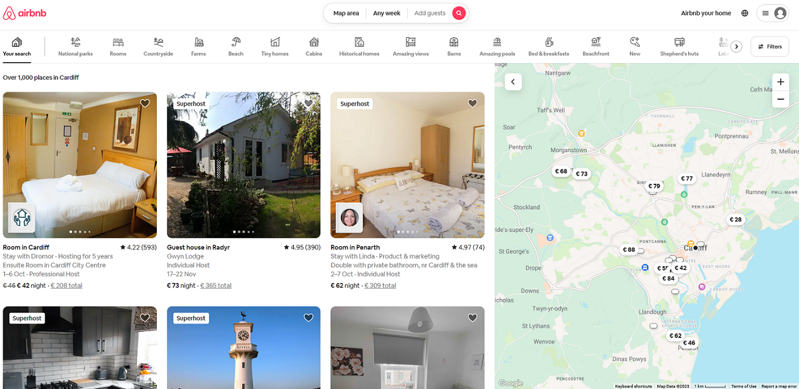

# Airbnb Webscraper (Project name: Doorbll)
A Python script to web scrape Airbnb property listing data for a specific location using Airbnb's mapping APIs. It can be used to collect data on Airbnb listings in a given area for further analysis or research purposes.

## Prerequisites
Written for Windows, the 'os' module is only required for saving files to HDD and can be easily adapted for Linux. Uses the following dependencies:
  - `requests`
  - `os`

## Configuration
`SEARCH_URL`: The URL of the Airbnb search results page for your desired location. This is obtained by navigating to Airbnb and searching for listings in a particular area, eg: Cardiff. It is essential you move and position the map on the right hand side to show the whole area you want to scrape. This will update the URL in your browser with the co-ordinates of the viewing area. Copy the URL from your browser and paste it into this string.

In this example the URL in the browser is long and contains co-ordinates:

~~~
https://www.airbnb.co.uk/s/Cardiff/homes?tab_id=home_tab&refinement_paths%5B%5D=%2Fhomes&flexible_trip_lengths%5B%5D=one_week&monthly_start_date=2023-10-01&monthly_length=3&price_filter_input_type=2&price_filter_num_nights=5&channel=EXPLORE&query=Cardiff&place_id=ChIJ9VPsNNQCbkgRDmeGZdsGNBQ&date_picker_type=calendar&source=structured_search_input_header&search_type=user_map_move&ne_lat=51.56254339587591&ne_lng=-3.1086694163246875&sw_lat=51.42425490981839&sw_lng=-3.297267432799458&zoom=12.172262287467554&zoom_level=12.172262287467554&search_by_map=true
~~~  

`LOCATION`: The location for which you want to scrape Airbnb data. A folder of this name will be created within the working directory. This value is also used in the inital cookie creation request, so should be an recognised name of a town/city.  

`CURRENCY`: The currency in which pricing information is displayed (eg, 'GBP').  

`APPEND_ADDITIONAL_STAY_INFO`: Set this to `True` if you want to retrieve additional pricing information for listings. The scraping process is done in two parts. The first, ExploreAPI, is non-optional and saves listing information. The second, staysAPI, appends the additional pricing information to the JSON files where possible. This is typically effective 80-90% of the time, see **Limitations**.

## Limitations

Pricing information will not be appended when any of the following is true:
  - The listing has 0 availability
  - The listing has a minimum stay of more than 5 nights
  - The listing has no availability for at least 5 nights
  - The listing has no availability in the next two months

The header and payloads are not modified beyond the co-ordinates, there is scope to further filter results as required.

## Usage

This script uses Airbnb's public APIs for data extraction, with rate-limiting of one request every 3 seconds.  
This may be outside Airbnb's terms of service. Using a VPN is recommended to avoid having your IP address blocked.  

## License

This project is licensed under the MIT License. See the [LICENSE](LICENSE) file for details.
